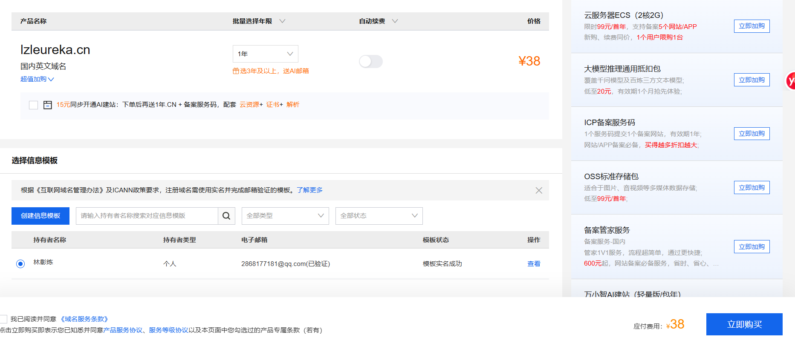
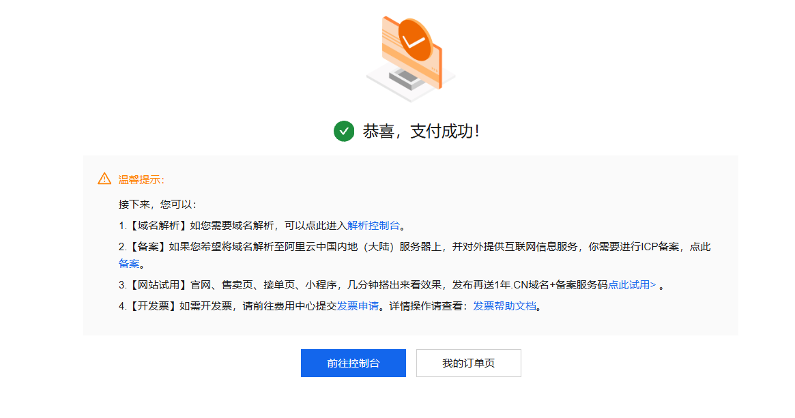
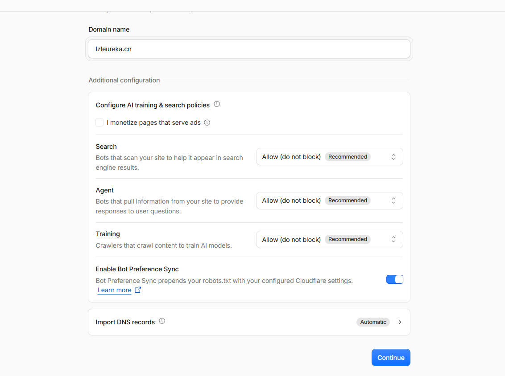
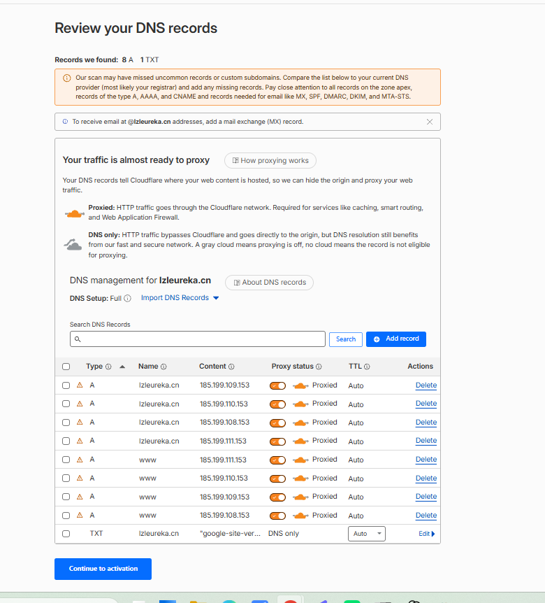
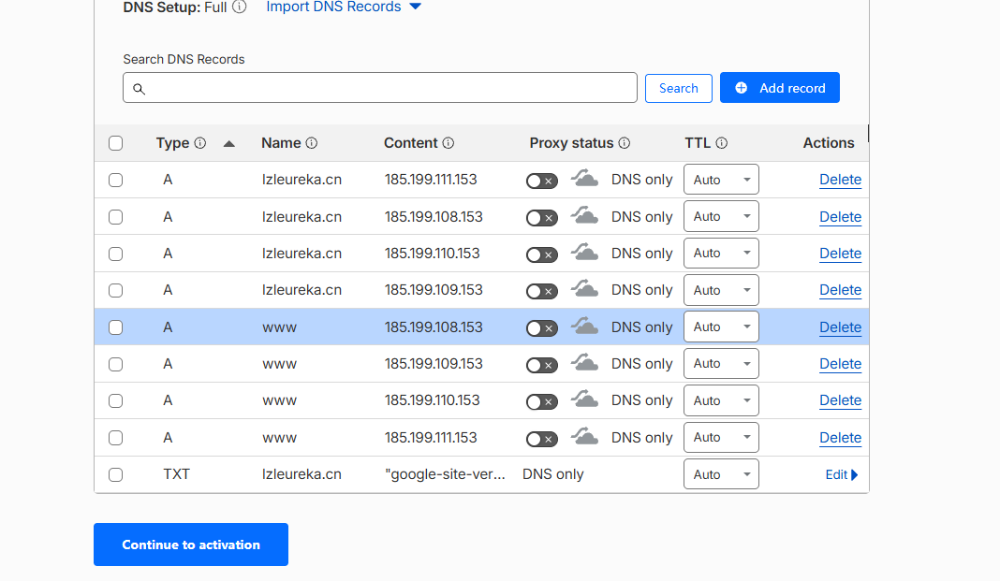
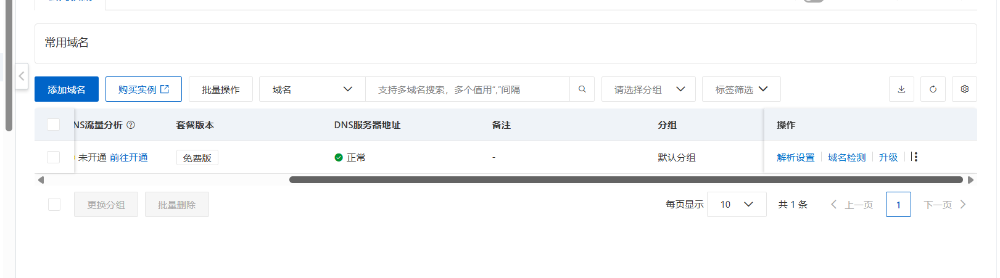
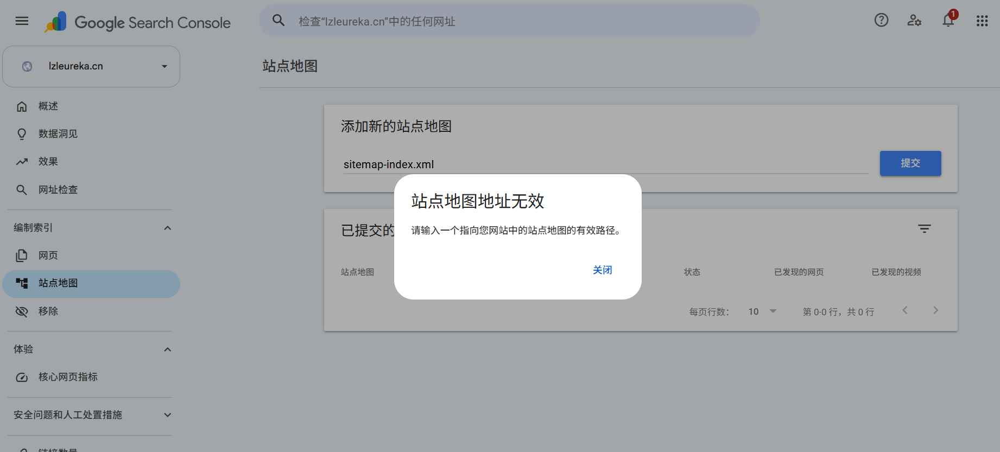

> **一句话结论：花 38 块钱买一年域名，按本文 6 个步骤操作，1 小时内你的博客就能从 `xxx.github.io` 变成 `你自己的域名.com`，带 HTTPS 小锁，Google 可以搜到。不买服务器，不需要备案。**
>
> 本文是我 2026 年 9 月真实操作一遍的记录，每一步都有截图。原理和名词解释写在[姊妹篇《自定义域名背后的原理》](/posts/engineering/blog-guide/custom-domain-principles/)里，只想照做的不用点开。

## 你需要准备

| 东西 | 说明 |
|---|---|
| 一个能访问的 GitHub Pages 博客 | 本文以 Astro 主题 Fuwari 为例，任何 GitHub Pages 站都适用 |
| 支付宝或微信 | 买域名用 |
| 预算 | 域名 ¥38/年（.cn），仅此一项 |
| 一台能上网的电脑 | 全程网页操作，不用写代码 |

**总耗时：操作约 30 分钟 + 等待实名和证书生效（1~3 小时，期间不用盯着）。**

## 第 1 步：阿里云买域名（10 分钟）

1. 打开 [wanwang.aliyun.com](https://wanwang.aliyun.com)，支付宝扫码注册登录
2. 搜索框输入想要的名字，选 `.cn`（首年 ¥38）或 `.com`（首年几十块，续费 ¥85+）
3. 加入清单 → 结算，按下面三处勾选：



- ✅ 年限选 **1 年**
- ✅ 信息模板选「个人」（没有就现场创建，填身份证信息，几分钟通过）
- ❌ 「15 元同步开通 AI 建站」等所有加购**一个都不要勾**，右侧服务器、备案服务统统无视——你的网站放在 GitHub（境外），**不需要备案，一分钱都不用多花**

4. 勾上底部「我已阅读并同意域名服务条款」→ 立即购买



5. 付款后进入 [域名控制台](https://dc.console.aliyun.com)，等域名状态变成「**已实名**」（一般几分钟到几小时）。**没实名成功之前，后面的解析都不生效**，这一步是硬性等待。

## 第 2 步：Cloudflare 接管域名解析（10 分钟）

> 为什么不用阿里云自带的解析？因为它对海外访问响应太慢，会导致后面 GitHub 的检查超时、HTTPS 证书永远签不出来（我实测卡了 2 小时，换 Cloudflare 后 0.5 秒，原理见姊妹篇）。**直接用 Cloudflare，少走一遍弯路。**

1. 打开 [dash.cloudflare.com](https://dash.cloudflare.com) 注册账号（免费）
2. 「Add a domain / 添加站点」→ 输入你的域名 → 选最底下的 **Free $0** 套餐
3. 搜索引擎爬虫策略全部保持「Allow」→ Continue：



4. **关键一步**：Cloudflare 会自动扫出你域名下的记录。确认有这 8 条 A 记录，**每条都要点成灰色「DNS only」**：



| 类型 | 名称 | 内容 | 状态 |
|---|---|---|---|
| A | `@` | `185.199.108.153` | 仅 DNS（灰云） |
| A | `@` | `185.199.109.153` | 仅 DNS（灰云） |
| A | `@` | `185.199.110.153` | 仅 DNS（灰云） |
| A | `@` | `185.199.111.153` | 仅 DNS（灰云） |
| A | `www` | `185.199.108.153` | 仅 DNS（灰云） |
| A | `www` | `185.199.109.153` | 仅 DNS（灰云） |
| A | `www` | `185.199.110.153` | 仅 DNS（灰云） |
| A | `www` | `185.199.111.153` | 仅 DNS（灰云） |

> 这 4 个 IP 是 GitHub Pages 的官方服务器地址，全世界的 `*.github.io` 都是它们。带 www 和不带 www 的域名都配上，谁输哪个都能到。



5. 点「Continue to activation」，Cloudflare 会给你 **2 个名称服务器**，形如：

```
carter.ns.cloudflare.com
dawn.ns.cloudflare.com
```

（你的和我不一样，以你页面显示的为准）复制下来，进入第 3 步。

## 第 3 步：回阿里云，把 DNS 服务器换成 Cloudflare 的（5 分钟）

1. 打开 [dc.console.aliyun.com](https://dc.console.aliyun.com)（注意是 **dc** 开头的域名控制台，不是解析控制的 dns 开头——我第一次就进错页面了）：



2. 域名列表 → 你的域名 → 「管理」→ 左侧「**DNS 修改**」→「修改 DNS 服务器」
3. 把原来的 `dns21.hichina.com`、`dns22.hichina.com` **替换**成 Cloudflare 给的那 2 个地址 → 保存（可能要手机验证码）

生效需要几分钟到几小时（.cn 注册局要更新记录）。期间 Cloudflare 首页的站点状态会从 Pending 变成 **Active**，看到 Active 就成了。

## 第 4 步：GitHub Pages 绑定域名（5 分钟）

1. 打开你的博客仓库 → **Settings → Pages**
2. 「Custom domain」填入你的域名（如 `lzleureka.cn`）→ Save
3. 等 DNS 检查通过（页面显示绿色勾，Cloudflare 生效后通常几分钟）
4. 勾选「**Enforce HTTPS**」（强制 HTTPS）

> 如果你用的也是 Astro/Fuwari：在 `astro.config.mjs` 里把 `site` 改成 `https://你的域名`、`base` 改成 `/`，再在 `public/` 下放一个 `CNAME` 文件（内容就一行：你的域名），提交推送。sitemap、RSS 都会自动跟着新域名走。

## 第 5 步：验证

浏览器打开 `https://你的域名`：

- ✅ 网页能打开
- ✅ 地址栏有小锁（HTTPS）
- ✅ 带不带 www 都能访问

搞定。你的博客从此有了自己的名字。

## 第 6 步：让 Google 能搜到（10 分钟）

1. 打开 [search.google.com/search-console](https://search.google.com/search-console) → 登录 Google 账号
2. 属性类型选「**网域 / Domain**」→ 输入你的域名（不带 https）→ Google 给你一条 `google-site-verification=xxx` 的 TXT 记录
3. 回 Cloudflare → 你的域名 → DNS → 添加一条记录：类型 **TXT**、名称 `@`、内容粘贴那串 → 保存
4. 回 GSC 点「验证」✅
5. 左侧「站点地图 / Sitemaps」→ 输入 `sitemap-index.xml` → 提交
6. 左侧「网址检查」→ 粘贴你的首页地址 → 「**请求编入索引**」

Bing 更简单：[bing.com/webmasters](https://www.bing.com/webmasters) → 登录微软账号 → 「从 Google Search Console 导入」→ 一键全同步。

> **如果 sitemap 提交报「地址无效」**：别慌，大概率是 Google 还缓存着你域名「不存在」的旧记录（新域名常见，我的报错截图 ↓），等几小时或第二天重试即可。而且你的 `robots.txt` 里本来就声明了 sitemap 地址，Google 抓取时会自动发现，提交只是加速，不影响收录。



## 踩坑速查表

| 症状 | 原因 | 解决 |
|---|---|---|
| GitHub 显示 DNS check unsuccessful | 你的 DNS 对海外查询太慢（国内解析服务商常见） | 迁移到 Cloudflare（第 2、3 步） |
| HTTPS 一直不签发 | DNS 检查没通过，或者记录是橙色云 | 确认灰云 DNS only；确认 NS 已切到 Cloudflare |
| 域名打不开，但配置都对 | 解析缓存没过期，国内最长 6 小时 | 等，或换网络/设备再试 |
| GSC 报「站点地图地址无效」 | Google 的 DNS 负缓存还没过期 | 用「网址检查→请求编入索引」绕行，隔天重试 |
| 买完域名解析不生效 | 实名认证还没通过 | 域名控制台等状态变「已实名」 |

## 之后的日常

写文章就是：在 `src/content/posts/` 下建一个 Markdown 文件 → `git push` → 自动发布。前几篇可以顺手在 GSC「网址检查」里提交一下新文章网址，几周后网站有了信誉，Google 会自动来抓，连这步都省了。

---

*本文由 AI（GLM-5.3-Flash）生成，未经人工审阅*
