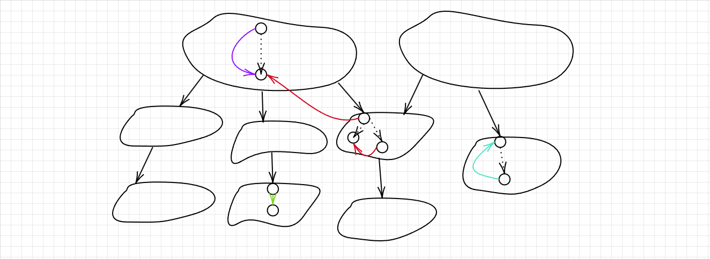
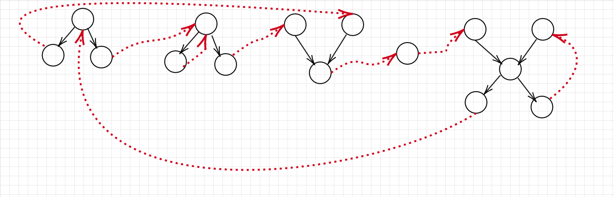

# 有向图的强连通分量（SCC）

## 概念
有向图的连通分量：对于分量中任意两点 $u,v$ ，必然可以从 $u$ 走到 $v$，且从 $v$ 走到 $u$

强连通分量：极大连通分量，也就是在这个连通分量里面任意加入一个点都不满足连通分量的定义

有向图的强连通分量的作用：将有向图的强连通分量进行缩点，进而转化成有向无环图（DAG），也就是拓扑图，方便使用递推求最短/长路

注意，以下所表示的双亲或者孩子都是从 `dfs` 序树来说明
树枝边：如下图所示，$dfn[u] = dfn[v]+1$，说明 $v \rightarrow u$ 是树枝边，这意味着 `dfs` 过程中，遍历了点 $v$ 之后就立马遍历 $u$ ，如下图绿色的边

前向边：如下图所示，假设 $dfn[u]=dfn[v]+1$，$u^\prime$ 是 $u$ 的后代，那么 $v \rightarrow u^\prime$是前向边，正如图中紫色的点，这也意味着这条边是在回溯的时候遍历的

后向边：如下图所示，假设 $v^\prime$ 是 $v$ 的后代，则 $v^\prime \rightarrow v$ 是后向边，正如图中青色的边

横叉边：如下图所示，当 $u$ 不是 $v$ 的孩子且 $dfn[u] < dfn[v]$ 时，说明有一条 $v\rightarrow u$ 的横叉边，正如图中红色边所示 


**求解强连通分量**
由于我们从某个点出发，不一定能够一直遍历所有点，因此要遍历所有结点，才能够完整地求该图的强连通分量。另外，从某个点开始求各个强连通分量，这里的所有点，一定是不重不漏地属于某个强连通分量。

从某个点出发，那么其所在的强连通分量的示意图一定是上图所示。在 `dfs` 的过程中，$dfn[u]=low[u]$ 的点一定是强连通分量在 `dfs` 序树上的根。

其中 $dfn[u]$ 表示点 $u$ 的时间戳，$low[u]$ 表示从$u$能够遍历到没有在某个强连通分量的时间戳的最小值。

那么，为什么 $dfn[u]=low[u]$ 是判断出某个强连通分量的重要依据？
首先，先来看算法特性，在求强连通分量的过程中，我们假设是有一个递归最后的强连通分量，那么根据时间戳来说，我们最后回溯到 $u$ 的时候，其后面遍历的所有点一定是强连通分量里面的所有点，因此，每当遍历一个新点的时候，我们选择使用栈来保存每个点

然后就是正常的 `dfs` 来遍历每个点，如果我们可以往下遍历，那么其孩子能够到的最小时间戳，也是当前点能到的时间戳，如果是可以走到一个已经遍历的点，那么这个点有着一个有效或者无效的概念，区别在于是否在栈中，如果是前向边，有效或者无效没有意义，因为 $low$ 值不会更新；如果是后向边，首先这个点一定是在栈中，然后同时其 $low$ 值也可更新；如果是横叉边，那么如果所对应的点不在栈中，说明这个点已经作为某个强连通分量中的点出栈了，如果在栈中，则说明其 $low$ 值一定可以更新。因为横叉过去的那个点$v$其不会出栈的理由在于 $low[v] \lt dfn[v]$ ，同理 $low[v]$ 这个点没有出栈的理由也是在于 $low[low[v]] < dfn[low[v]]$，如此往上，定会走到 $(u,v)$ 的一个公共祖先，因此可以发现 $u \rightarrow v$ ，也可以 $v \rightarrow u$ 。**综合起来就是如果判断的是时间戳比较小的，如果它在栈中，就可以更新 $low$ 值**。

从而，无法更新也就意味着这个强连通分量的 `dfs` 序根找到了

代码如下：
```c++
/* 
    // 求强连通分量
    for (int i = 1; i <= n; i ++ )
        if (!dfn[i])
            tarjan(i);
*/
void tarjan(int u) {
    dfn[u] = low[u] = ++ timestamp;
    stk[top ++ ] = u, in_stk[u] = true;
    
    for (int i = h[u]; ~i; i = ne[i]) {
        int v = e[i];
        if (!dfn[v]) {
            tarjan(v);
            low[u] = min(low[u], low[v]);
        } else if (in_stk[v]) low[u] = min(low[u], dfn[v]);
    }
    
    if (low[u] == dfn[u]) {
        ++ scc_cnt;
        int p;
        do {
            p = stk[ -- top];
            in_stk[p] = false;
            id[p] = scc_cnt;
        } while (p != u);
    }
}
```

## 拓展
使得任意一个图变成强连通分量需要加的最少边数？
首先对这个图进行 tarjan 缩点
1. 如果这个图本身是强连通分量，那么就不需要加
2. 如果这个图不是强连通分量，那么对其缩点后一定是多个拓扑图，假设入度为 0 的点的数量为 $din$，出度为 0 的点的数量为 $dout$ ，那么最少需要加入 $max(din, dout)$ 条边就能变成强连通图，正如下图所示



# 无向图的双连通分量（DCC）

双连通分量分为点双连通分量（`v-DCC`）和边双连通分量（`e-DCC`）

无向图的边双连通分量的作用：将无向图的边双连通分量进行缩点，进而转化成一棵树
## 概念

桥：桥为无向图中的一类特殊的边，删除这条边之后，图不再连通，我们称这样的边为**桥**

边双连通分量：**极大的**不含有桥的连通块就称这个连通块为**边连通分量**，换句话说，这样的图里面任意两点之间都有两条不相交的路径（点可以相交）

割点：如果在图中把某个点以及它相关的边删掉，整个图不连通了，就称这个点为这个图的一个割点

点双连通分量：**极大的**不包含割点的连通块，我们称为点双连通分量

**每个割点至少属于两个连通分量**

**两个割点之间的边不一定是桥，一个桥之间的两个端点也不一定是割点，割点和桥之间并没有什么关系**

**点双连通分量不一定是边双连通分量，边双连通分量不一定是点双连通分量**

## 求解

### 边双连通分量

求解边双连通分量事实上和求有向图的强连通分量思路差不多，要注意的两点就是**找桥**和由于链式前向星的建图特性，**我们不能通过建立的反向边往上遍历，或者说更新 $low[u]$** ，因为本质上这是一条边。

如何找桥？当遍历到某个，然后我们不能回到这个点的父亲结点的时候，说明这两个点连接的边是桥，从父亲角度来说，也就是 $low[u] < low[v]$ 的时候，当前这条边是桥

如果判断反向边？如果之前遍历的边的下标为 $from$，那么这里就不能通过 $from \oplus 1$ 来遍历或者说更新 $low[u]$

**注意：由于无向图中不会存在横叉边，所以 in_stk 数组本质上是可以省略的**

代码如下：
```c++
int h[N], e[M << 1], ne[M << 1], idx = 0;
int n, m;
vector<pair<int, int>> bridge;
int d[N];
int dfn[N], low[N], timestamp = 0;
int stk[N], tt = 0;
int id[N], dcc_cnt = 0;

void tarjan(int u, int from) {
    dfn[u] = low[u] = ++ timestamp;
    stk[tt ++ ] = u;
    
    for (int i = h[u]; ~i; i = ne[i]) {
        int v = e[i];
        if (!dfn[v]) {
            tarjan(v, i);
            low[u] = min(low[u], low[v]);
            if (low[u] < low[v]) {
                bridge.push_back({u, v});
                // 这里可以把图保存下来，也可以标记边
            }
        } else if (i != (from ^ 1)) low[u] = min(low[u], dfn[v]);
    }
    
    if (dfn[u] == low[u]) {
        ++ dcc_cnt;
        int y;
        do {
            y = stk[-- tt];
            id[y] = dcc_cnt;
        } while (y != u);
    }
}
```

**注意：在使用 from^1 != i 判断的时候一定要保证同时建立双向边**
### 点双连通分量

#### 求割点

对于一条边 $(x,y)$ ，有 $dfn[x] < dfn[y]$ ，对于 $low[y] \ge dfn[x]$， 有
1. 如果 $x$ 不是根节点，那么 $x$ 是割点
2. 如果 $x$ 是根节点，至少有两个子结点 $y_i$ 使得 $low[y_i] \ge dfn[x]$ 

代码如下：
```c++
/*
遍历注意设置全局根节点
for (root = 0; root < n; root ++ )
    if (!dfn[root]) 
        tarjan(root);
*/
int n, m, root;
int h[N], e[M], ne[M], idx = 0;
int dfn[N], low[N], timestamp = 0;
vector<int> point; // 存放割点

void add(int a, int b) {
    e[idx] = b, ne[idx] = h[a], h[a] = idx ++ ;
}

void tarjan(int u) {
    dfn[u] = low[u] = ++ timestamp;
    
    int cnt = 0;
    for (int i = h[u]; ~i; i = ne[i]) {
        int v = e[i];
        if (!dfn[v]) {
            tarjan(v);
            if (dfn[u] <= low[v]) cnt ++ ;
            low[u] = min(low[u], low[v]);
        } else low[u] = min(low[u], dfn[v]);
    }
    if (cnt + (root != u) > 1) point.push_back(u)// u 是割点
}
```
#### 求点双连通分量

点双连通分量的缩点方案是：1. 割点单独作为一个点。 2. 从每个 V-DCC 向其所包含的每个割点连边
对其进行缩点之后，图中点的数量等于所有连通分量的数量+割点的数量

注意：求点连通分量是要把割点存进去的，一个割点可能在多个不同的连通分量中。

代码如下：
```c++
/* 预处理
        for (int i = 1; i <= dcc_cnt; i ++ ) dcc[i].clear();
        memset(dfn, 0, sizeof dfn);
        memset(h, -1, sizeof h);
        memset(cut, 0, sizeof cut);
        dcc_cnt = timestamp = tt = idx = 0;
*/  
/* 求点双连通分量
        for (root = 1; root <= n; root ++ )
            if (!dfn[root])
                tarjan(root);
*/                
/* 求每个点双连通分量里面有多少个割点
        for (int i = 1; i <= dcc_cnt; i ++ ) {
            int cnt = 0;
            for (auto &u: dcc[i])
                if (cut[u]) cnt ++ ;
        }
*/
int root;
int h[N], e[N], ne[N], idx = 0;
int dfn[N], low[N], timestamp;
vector<int> dcc[N];
int dcc_cnt;
int stk[N], tt = 0;
bool cut[N];

void tarjan(int u) {
    
    dfn[u] = low[u] = ++ timestamp;
    stk[tt ++ ] = u;
    
    if (root == u && h[u] == -1) {
        
        ++ dcc_cnt;
        dcc[dcc_cnt].push_back(u);
        return ;
    }
    int cnt = 0;
    for (int i = h[u]; ~i; i = ne[i]) {
        int v = e[i];
        if (!dfn[v]) {
            tarjan(v);
            low[u] = min(low[v], low[u]);
            if (dfn[u] <= low[v]) {
                cnt ++ ;
                if (root != u || cnt > 1) cut[u] = true;
                ++ dcc_cnt;
                int y;
                do {
                    y = stk[-- tt];
                    dcc[dcc_cnt].push_back(y);
                } while (y != v);
                dcc[dcc_cnt].push_back(u);
            } 
        } else low[u] = min(low[u], dfn[v]);
    }
}

```