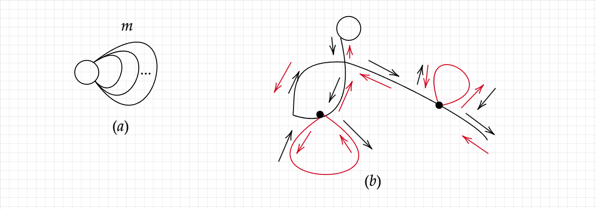

# 欧拉路径与欧拉回路

**注意：所有边连通且可以存在孤立点**
**在无向图中，**
1. 一个图**存在欧拉路径**的充分必要条件：度数为奇数的点只能有 0 个或者两个
2. 一个图**存在欧拉回路**的充分必要条件：度数为奇数的点只能为 0 个

**在有向图中，**
1. 一个图**存在欧拉路径**的充分必要条件：要么所有点的入度等于出度，要么除了两个点之外，其余所有点的出度等于入度，剩余的两个点：一个满足于入度比出度多1（终点），一个满足出度比入度多1（起点）。
2. 一个图**存在欧拉回路**的充分必要条件：所有点的入度等于出度

**证明**

必要条件：
无论是有向图还是无向图的必要条件证明都是从以下思路出发，首先对于图中的一笔画问题，肯定是有一个起点和终点，那么除了起点和终点，其余所有点都需要先进来再出去，然后对于起点来说可以没有过来的点，对于终点来说可以没有可以去的点。对于回路来说，就是所有点都需要进去和出去。

充分条件：
通过给出一种构造方案来进行证明

**构造方案：**

```
dfs(u) {
	for  u 的所有边
		 dfs() // 扩展
	seq <- u // u 加入到路径序列中
}
```
此构造方案为欧拉路径的逆序，正如下图中的 $(b)$，首先从一个奇数点（起点，如果奇数点为0，则任意点）一直往后遍历，由于中间点的度数是偶数，因此遍历到中间点一定可以再去下一条边，直到回到起点（如果是欧拉回路，一定是起点），或者某个点的度为奇数（终点）。然后就是回溯，在回溯的过程中保存欧拉回路/路径的点，然后如果碰到了没有遍历完的点，则继续遍历，因此此时已经没有终点，所以最终一定会回到这个点，这样就相当于在此处有一个环，也可以通过逆序的方式将其欧拉路径融合起来。从而所得欧拉路径就是一个终点到起点的欧拉路径逆序。

**注意**
使用邻接表存储时，假设图是一个有 $m$ 条边的自环，正如下图中的$(a)$，事实上，时间复杂度是 $O(m^2)$ 的，如果是邻接矩阵就是 $O(nm)$ 的时间复杂度。因此，在 $m$ 比较大的时候，可以选择直接删除一条边来降低**时间复杂度为 $O(n+m)$**

事实上，在随机数据上，这个时间复杂度还是挺快的。

另外，在删边方面，有向图删边直接就删除了，但是在无向图里面，由于是加入了正反两条边，因此，根据链式前向星的特性，$i$ 所对应的反边在 $i \oplus 1$ 


## 欧拉回路
### 判断欧拉回路

有向图
```c++
// 在添加边的时候注意计算入度和出度即可
for (int i = 1; i <= n; i ++ )
    if (din[i] != dout[i]) {
        puts("NO");
        return 0;
    }
```

无向图
```c++
// 在添加边的时候同样可以计算入度和出度，而且只需要计算一次即可
// 因此一条边要么是作入度要么作出度
// 相较于某个点来说，只需要作入度和作出度的总共次数为偶数即可
// 因为我们没必要在建立反向边的时候也更新入度和出度
// 否则其判断方式为 din[i] & 1
// 如果只考虑无向边，则计算度然后用度判断即可
for (int i = 1; i <= n; i ++ )
    if (din[i] + dout[i] & 1) { // 或者 d[i] & 1
        puts("NO");
        return 0;
	}
```

### 求欧拉回路方案

注意：如果是求**欧拉路径**，对于有向图来说，初始点一定是出度数-入度数=1的点；对于无向图来说，初始点一定是度数为奇数两个点中的一个点。
#### 边方案

**边标记**
```c++
/*
这里只是把用过的边进行标记，但是并没有删除
对于上述说的情形，事实上这个这个复杂度是 O(m^2)
*/
void dfs(int u) {
    
    for (int i = h[u]; ~i; i = ne[i]) {

        if (used[i]) continue;
        used[i] = true;
        // 如果不是无向图，下面这行删掉
        if (type == 1) used[i ^ 1] = true; 
        dfs(e[i]);
        
        int t = i + 1;
        if (type == 1) {
            t = i / 2 + 1;
            if (i & 1) t = -t;
        }
        path[++ cnt] = t;
    }
}
```

**删边优化**
```c++
/*
注意在for循环中，后面是 i = h[u]，表示每次只使用当前可用的边
如果不加入此优化，复杂度最坏可为 O(m^2)
*/
void dfs(int u) {
	
    for (int i = h[u]; ~i; i = h[u]) {

        h[u] = ne[i];
        if (used[i]) continue;
        if (type == 1) used[i ^ 1] = true;

        dfs(e[i]);

        int t = i + 1;
        if (type == 1) {
            t = i / 2 + 1;
            if (i & 1) t = -t;
        }
        path[++ cnt] = t;
    }
}
```

#### 点方案

# 2-SAT

## 建图

对于任意一个布尔变量，拆成两个点，分别为 $x_i$ 和 $\neg x_i$ 
若给定一个 $x_i \vee x_j$ ，建造两条边，分别为 $\neg x_i \rightarrow x_j$ 和 $\neg x_j \rightarrow x_i$ ，如果 $x_i,\neg x_i$ 出现同一个强连通分量里面，说明这个逻辑表达式有矛盾，如果没有遍历每个点，对于 $x_i,\neg x_i$ 来说，谁的 `id` 值越小，就取值哪个 

但是题目不一定是给出 $x_i \vee x_j$ ，有可能是 $a\rightarrow b$ 或者 $a=1/0$ ，对于 $a = 1$ ，可以转化成 $a \vee a$ 