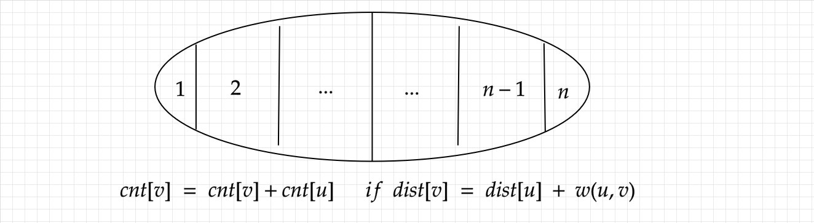

# 单源最短路

## 朴素版 dijkstra
时间复杂度：$O(n^2)$
限制：图中可能存在重边和自环，所有边权均为正值。
应用：一般应用于点的数量不多，边的数量比较多，也就是**稠密图**
算法流程：
1. 初始化 `dist` 数组，源点设置为 0
2. 在所有的 `dist` 数组中找到一个没有更新过的点(`!st[j]`)，且 `dist` 的值最小的下标 `p`，并设置 `st[p]=true`
3. 遍历 `p` 的所有出度边，更新 `dist` 数组
4. 重复 step 2 和 step 3 共 n - 1 次

代码如下：
```c++
/*
图的预处理
memset(g, 0x3f, sizeof g);
for (int i = 0; i < N; i ++ ) g[i][i] = 0;

读入边时的处理
g[u][v] = min(g[u][v], w);
*/

const int N = 510, INF = 0x3f3f3f3f;

int n, m; 
int g[N][N], dist[N];
bool st[N];

int dijkstra() {
    memset(dist, 0x3f, sizeof dist);
    dist[1] = 0;
    
    for (int i = 0; i < n; i ++ ) {
        int p = -1;
        for (int j = 1; j <= n; j ++ )
            if (!st[j] && (p == -1 || dist[p] > dist[j])) p = j;
        st[p] = true;
        
        for (int j = 1; j <= n; j ++ )
            if (dist[p] + g[p][j] < dist[j])
                dist[j] = dist[p] + g[p][j];
    }
    return dist[n] == INF ? -1 : dist[n];
}
```

## 堆优化的 dijkstra
时间复杂度：$O(mlogn)$
限制：图中可能存在重边和自环，所有边权均为正值。
应用：一般应用于**稀疏图**中
算法流程：
1. 同样地，初始化 `dist` 数组，源点设置为0，并且以 `{dist值，点的下标}` 放入小根堆中
2. 从小根堆中取出堆顶，判断堆头的点是否已经遍历(`st[id]`)，是则继续取出堆顶，否则将该点设置为 `st[id]=true` 
3. 遍历该点的所有边，如果满足三角不等式 `dist[v] > dist[id]+w[i]` 则更新 `dist[v]` 的值，然后将其压入堆中
4. 重复 step 2 和 step 3，直到堆为空

代码如下：
```c++
/*
图的存储：链式前向星
注意初始化 h 数组为 -1
*/

const int N = 150010, INF = 0x3f3f3f3f;

typedef pair<int, int> PII;

int n, m;
int h[N], e[N], ne[N], w[N], idx = 0;
int dist[N];
bool st[N];

int dijkstra() {
    priority_queue<PII, vector<PII>, greater<PII>> Q;
    memset(dist, 0x3f, sizeof dist);
    dist[1] = 0;
    Q.push({0, 1});
    
    while (Q.size()) {
        auto [val, id] = Q.top(); Q.pop();
        if (st[id]) continue;
        st[id] = true;
        
        for (int i = h[id]; ~i; i = ne[i]) {
            int v = e[i];
            if (dist[v] > dist[id] + w[i]) {
                dist[v] = dist[id] + w[i];
                Q.push({dist[v], v});
            }
        }
    }
    return dist[n] == INF ? -1 : dist[n];
}
```

## bellman-ford 算法
时间复杂度：$O(nm)$
特点：图中可能存在重边和自环， **边权可能为负数**。图中可能 **存在负权回路** 。
应用：最多走 $k$ 条边的最短路，判断回路中是负权回路
算法流程：
1. 初始化 `d` 数组为无穷大，然后源点的值设置为 0
2. 遍历每条边，满足三角不等式 $d[from] + w < d[v]$ ，做一次松弛操作
3. 重复 step 2 一共 $n - 1$ 次，如果边权没负数，则此时已求出最短路；如果边权有负数，再重复一遍 step 2，判断 `d` 数组有无变化，有则说明存在负权回路
**注意：**
1. 如果是指明最多 `k` 条边的最短路，则松弛操作只能用上一轮的结果；还有松弛操作是用 `d[y]=backup[x] + w` 可能更新多次不会改变遍历多条边？不是，你只能让从上一轮到这一轮的**答案更小**，并不会多更新边
2. 另外，如果是判断源点到某汇点是否有最短路，不能直接判断是否等于`INF`，而是用是否大于 `INF / 2`来判断
3. 再注意，如果是有负权边，则没有最短路径不能返回 -1，因为 -1 可能是答案
代码如下：
```c++
const int N = 10010;
const int INF = 0x3f3f3f3f;

int n, m, k;
struct Node {
    int a, b, w;
} g[N];
int d[N], backup[N];

int bellman_ford() {

    memset(d, 0x3f, sizeof d);
    d[1] = 0;
    for (int i = 0; i < k; i ++ ) {

        memcpy(backup, d, sizeof backup);
        for (int j = 0; j < m; j ++ ) {
            int x = g[j].a, y = g[j].b, w = g[j].w;
            if (d[y] > backup[x] + w)
                d[y] = backup[x] + w;
        }

    }
    if (d[n] > INF / 2) return -1;
    return d[n];
}
```
## spfa 算法
最坏时间复杂度：$O(nm)$

特点：图中可能存在重边和自环， **边权可能为负数**。图中可能 **存在负权回路** 。
应用：判断回路中是否有负权回路

spfa 算法本质上是优化了 bellman-ford 算法，因为 bellman-ford 算法是每次暴力枚举所有的边然后无差别松弛，但是事实上只有更新过的点对其进行松弛才有意义。因此，spfa做得优化就是使用队列存储进行过松弛的点，然后利用这些点再进行更新。

注意：
1. `st[i]` 表示点 $i$ 是否在队列里面
2. 然后使用的是循环队列，因为每个点可能不止入队，出队一次，但是里面最多是有 $n$ 个点，所以循环队列最优

代码如下：
```c++
const int N = 100010;

int n, m;
int h[N], e[N], ne[N], w[N], q[N], d[N], idx, hh = 0, tt = 0;
bool st[N]; 

int spfa() {
    
    memset(d, 0x3f, sizeof d);
    d[1] = 0, q[0] = 1, st[1] = true;
    int hh = 0, tt = 1;
    
    while (hh != tt) {
        int t = q[hh ++ ];
        if (hh == N - 1) hh = 0;
        st[t] = false;
        
        for (int i = h[t]; ~i; i = ne[i]) {
            int v = e[i];
            if (d[t] + w[i] < d[v]) {
                d[v] = d[t] + w[i];
                if (!st[v]) {
                    q[tt ++ ] = v;
                    if (tt == N - 1) tt = 0;
                    st[v] = true;
                }
            }
        }
    }
    return d[n];
}
```


### spfa 判断负环

判断负环重要的环节就是判断一个点被松弛的次数是否 $\ge n$，或者最短路里的边数 $\ge n$  ，因此在原来spfa算法的基础上，加入 `cnt` 数组来记录即可

注意：
1. 如果只是判断负环，那么由于图可能不连通，所以初始化需要把所有点都加入到队列里面，然后每个点的 `d` 值都为 $0$，这个就好比加入了一个超级源点，然后超级源点连接了图中每一个点，且权值为 $0$
2. 注意，`d` 数组在松弛的过程中不可不更新

```c++
int n, m; 
int h[N], e[N], ne[N], w[N], idx = 0;
int d[N], cnt[N], q[N], hh = 0, tt = 0;
bool st[N];

bool spfa() {
    
    for (int i = 1; i <= n; i ++ ) {
        st[i] = true;
        q[tt ++ ] = i;
    }
    
    while (hh != tt) {
        int u = q[hh ++ ];
        if (hh == N - 1) hh = 0;
        
        st[u] = false;
        for (int i = h[u]; ~i; i = ne[i]) {
            int v = e[i];
            if (d[u] + w[i] < d[v]) {
                d[v] = d[u] + w[i];
                cnt[v] = cnt[u] + 1;
                if (cnt[v] >= n) return true;
                if (!st[v]) {
                    st[v] = true;
                    q[tt ++ ] = v;
                    if (tt == N - 1) tt = 0;
                }
            }
        }
    }
    return false;
}
```

### spfa 找正环例题
spfa 找正环的广度比我想象的还要广：比如 [货币兑换](https://www.acwing.com/problem/content/description/4245/) ，点的权值变化是 $x_j = (x_i - C_i )* R_i$ ，判断是否有正环。这得益于 spfa 只要松弛了就需要继续更新其他点。所以，彻底理解spfa的机制还是非常有价值的

### 0/1 分数规划
形如 $\frac{\sum{f_i}}{\sum{w_i}}$ 的式子的最大值或者最小值，可以使用 [[二分&三分#二分]] + [[#spfa 判断负环]] 来求解

对于这样的问题，我们统一使用 0/1 规划求解，首先二分答案为 $mid$，然后假设**存在一个环** $\frac{\sum{f_i}}{\sum{w_i}} \gt mid$ ，那么其答案一定在 $[mid,r]$ 之间；如果对于**任意的环**，都使得 $\frac{\sum{f_i}}{\sum{w_i}} \lt mid$ ，那么答案肯定在 $[l,mid]$ 之间。

首先对于 $\frac{\sum{f_i}}{\sum{w_i}} \gt mid$，我们做一些转化
$$
\frac{\sum{f_i}}{\sum{w_i}} \gt mid \iff \sum (f_i - mid * w[i]) \gt 0
$$
换句话说，判断一个环**是否存在**有 $\frac{\sum{f_i}}{\sum{w_i}} \gt mid$ 等价于判断对边权进行修改后的图**是否存在有正环**。

注意，为什么不用 $\frac{\sum{f_i}}{\sum{w_i}} \lt mid$ 做判断，其原因就在于我们要对于 **任意的环**，而我们没有判断任意环都是负环的做法。

因此，对于 $0/1$ 规划的问题，**一定要从存在的前缀的不等式那边找环**

# 多源最短路
## Floyd 算法
时间复杂度：$O(n^3)$

特点：可以同时计算任意两点之间的最短距离。图中可能存在重边和自环，边权可能为负数。

floyd 算法的思路基于动态规划：$g(k,i,j)$ 表示只通过前 $k$ 个点进行松弛，点 $i$ 到点 $j$ 的最短路径。

转移：对于 $g(k,i,j)$ 来说，值从两种情况得到，一种是 $i$ 到 $j$ 的最短路径没有包含 $k$，一种是包含了 $k$。对于第一种情况，就是 $g(k-1,i,j)$，对于第二中情况，我们知道 $k$ 一定是 $i$ 到 $j$ 路径上的某个点，所以此时将路径 $(i,j)$ 分成 $(i,k),(k,j)$ 两部分，另外在这两部分里面都是没有包含 $k$ 的，最多是 $k-1$。
因此，$g(k,i,j)=min(g(k-1,i,j),g(k-1,i,k)+g(k-1,k,j))$。

滚动数组：可以看到 $g(k,i,j)$ 的转移之和上一轮的结果有关，因此去掉一维就是 $g(i,j)=min(g(i,j),g(i,k)+g(k,j))$ ，由于 $g(k,i,k)=g(k-1,i,k),g(k,k,j)=g(k-1,k,j)$  直接去掉一维是等价的

初始化：最开始的 $g$ 值表示没有松弛的时候，也就是原图初始的样子。

代码如下：
```c++
int g[N][N];

void Floyd() {
    
    for (int k = 1; k <= n; k ++ )
        for (int i = 1; i <= n; i ++ )
            for (int j = 1; j <= n; j ++ )
                g[i][j] = min(g[i][j], g[i][k] + g[k][j]);
}

//初始化
while (m -- ) {
    int x, y, z; cin >> x >> y >> z;
    g[x][y] = min(g[x][y], z);
}

// 判断结果
if (g[x][y] > 0x3f3f3f3f / 2) puts("impossible");
else cout << g[x][y] << endl;
```
### 传递闭包

传递闭包说到底就是值任意两个点的可达性，比如说 A 能到 B，B 能到 C，那么 A 就能到 C。可以使用 Floyd 求传递闭包

```c++
for (int k = 1; k <= n; k ++ )
	for (int i = 1; i <= n; i ++ )
		for (int j = 1; j <= n; j ++ )
			g[i][j] |= g[i][k] && g[k][j];
```

**拓展**
假设 `g[i][j]` 表示 $i > j$ 的情形，如果根据传递闭包判断每个人的排名是否已经确定？？
答：如果一个人的排名已经确定，小于这个人的人数+大于这个人的人数一定等于 n - 1
### 最小环问题
给定一张无向图，求图中一个至少包含 $3$ 个点的环，环上的节点不重复，并且环上的边的长度之和最小。

**解答**
我们知道，所有至少有 $3$ 个点的环，一定有一个编号最大的点 $k$ ，然后我们可以枚举这个点附近的两个点 $i,j（i<k, j<k)$ ，那么 $(i,k)$ 和 $(k,j)$ 的长度我们是已知的，那么问题就变成要求 $(i,j)$ 之间的最短路且不经过 $\ge k$ 的点。

那么这就能联想 `floyd` 的动态规划表 $f(k,i,j)$ 求的是只考虑前 $k$ 个点 $(i,j)$ 的最短路，因此，求解最小环的长度便可以在求 `floyd` 的过程中求解出来。

那么如果是求解一条最小环呢，也就是一个最小环的方案，这个同样也可以在求的过程中，一旦求出当前最小的环，然后把方案求解出来。因此，我们只需要求解 $(i,j)$ 的最短路的方案即可。

**在求 $(i,j)$ 的最短路方案的时候，不需要还原滚动数组**，因为最短路还是满足一个三角不等式的 $d(i,j) \le d(i,k)+ d(k,j)$ 的，不妨假设 $pre(i,j)=k$，表示 $d(i,j)$ 是从中间点 $k$ 转移的，那么一定是有 $d(i,k)$ 和 $d(k,j)$ 的路径不重复的。
因此，如果在当前有 $d(i,j)=d(i,k)+d(k,j)$，那么 $(i, ... ,k, ..., j)$ 是可行方案。

代码如下：
```c++
/*
数据结构和求路径函数
注意这里不能使用 f[i][j]==g[i][j] 来判断(i,j)中间是否有其他的点
int g[N][N], f[N][N], pre[N][N];
int path[N], cnt = 0;

void get_path(int i, int j) {
    if (!pre[i][j]) return ;
    
    get_path(i, pre[i][j]);
    path[cnt ++ ] = pre[i][j];
    get_path(pre[i][j], j);
}
*/

int res = INF;
for (int k = 1; k <= n; k ++ ) {
    
    if (k > 2) {
        for (int i = 1; i < k; i ++ )
            for (int j = i + 1; j < k; j ++ )
                if (1ll * f[i][j] + g[i][k] + g[k][j] < res) {
                    res = f[i][j] + g[i][k] + g[k][j];
                    cnt = 0;
                    path[cnt ++ ] = k; path[cnt ++ ] = i;
                    get_path(i, j);
                    path[cnt ++ ] = j;
                }
                
    }
    
    for (int i = 1; i <= n; i ++ )
        for (int j = 1; j <= n; j ++ )
            if (f[i][k] + f[k][j] < f[i][j]) {
                pre[i][j] = k;
                f[i][j] = f[i][k] + f[k][j];
            }
    
}
if (res != INF) {
    for (int i = 0; i < cnt; i ++ ) cout << path[i] << ' ';
    cout << endl;
} else puts("No solution.");
```

### 两点之间恰好经过 $k$ 条边的最短路
这个稍微和 `Floyd` 有点不一样，因为状态的设置不一样。$f(k, i, j)$ 表示从 $i$ 走到 $j$ 恰好经过 $k$ 条边的最短路，假设我们已经计算好了 $f(a,i,j)$ 和 $f(b,i,j)$ ，怎么计算 $f(a+b, i,j)$ ?

那么根据集合进行划分，$i$ 走了 $a$ 条边到达的是 $k$，因此 $f(a+b, i,j) = min_{k\in [1,n]}\{f(a,i,k)+f(b,k,j)\}$

由于这个问题是可以重复经过一些点，因此 $f(a,i,k)$ 和 $f(b,k,j)$ 之间路径互不影响，而且根据公式来看这个式子具有结合律。因此，可以尝试使用矩阵快速幂来加速计算。

代码如下：
```c++
matrix mul(matrix a, matrix b) {
    matrix c;
    memset(c.m, 0x3f, sizeof c.m);
    for (int k = 1; k <= n; k ++ )
        for (int i = 1; i <= n; i ++ )
            for (int j = 1; j <= n; j ++ )
                c.m[i][j] = min(1ll * c.m[i][j], 1ll * a.m[i][k] + b.m[k][j]);
    return c;
}
// 这里初始的res是任意两个点都不能到达，除了自己到自己最短路是 0
matrix kpow(matrix a, int k) {
    matrix res;
    memset(res.m, 0x3f, sizeof res.m);
    for (int i = 1; i <= n; i ++ ) res.m[i][i] = 0;
    while (k) {
        if (k & 1) res = mul(res, a);
        a = mul(a, a);
        k >>= 1;
    }
    return res;
}
```

# 单源最短路应用

## 乘积最大值

假如有一个图，边权 $0 <w \le 1$，然后求点 $A$ 到 $B$ 的权值最大乘积。
为什么这个可以直接用变形的 dijkstra 求解？
因为 $log(w_1\cdots w_k) = log(w_1)+\cdots+log(w_k)$ ，再加上 $w$ 的范围如此，所以 $log(w_i) \le 0$ ，这个问题就转化成了求 $\sum_{i=1}^klog(w_i)$ 的最大值，也就是 $-\sum_{i=1}^k-log(w_i)$ 的最大值，也就是 $\sum_{i=1}^k-log(w_i)$ 的最小值。由于 $-log(w_i) \ge 0$ ，这就等价于 dijkstra 算法流程。

如果是有 $w>1$ 情况咋办，可能就需要 spfa 来进行求解。

如果是有 $w \le 0$ 的情况，这个就暂时不清楚了

## 超级源点（虚拟点）

有些题可能需要超级源点连接所有的点（比如差分约束问题），有些题可能需要一个超级源点连接部分点（比如：多源最短路径问题）

## 求经过某个点的最小正环
首先从这个点出发，待到这个点更新了其他点，将这个点的最小距离更新为无穷大，因为一开始本质上是求从这个点到其他点的最短路，因此该操作也会求得经过这个点的最小正环

## 建反图
如果要求任意点到某个点的最短路，建立反图是不错的选择

# 差分约束

差分约束的作用有 **二**
1. 求某个特殊不等式组的一组可行解
2. 求所有点最大值或最小值

## 求某个特殊不等式组的可行解

特殊不等式组：诸如 $x_i \le x_j + C_{ij}$ 或者 $x_i \ge x_j + C_{ij}$ 的不等式组
我们可以将这样的不等式组转化成一个单源最短路问题，以 $x_i \le x_j + C_{ij}$ 为例：
1. 对每个不等式 $x_i \le x_j + C_{ij}$，转化成一条 $x_j$ 到 $x_i$ 的边，权值为 $C_{ij}$ 的一条边
2. 找一个超级源点，使得该源点一定可以遍历到所有边
3. 从源点求一遍单源最短路
	1. 结果1：如果存在负环，则不等式组无解
	2. 结果2：如果没有负环，则从源点到每个点的最短路径就是一组可行解

正确性分析：
1. 对于第一点，对于不等式 $x_i \le x_j + C_{ij}$，转化成边之后，根据最短路的结果一定有 $dist[x_i] \le dist[x_j] + C_{ij}$ ，因为如果有 $dist[x_i] \gt dist[x_j] + C_{ij}$ ，则说明 $dist[x_i]$ 还能再更新，这与最短路的结果相矛盾
2. 至于为什么要找超级源点？因为如果只是随便从某一个点出发，由于这个图可能不连通，或者到不了某些点，导致在图的遍历过程中并未有访问所有边，因为从第一点来说，我们是要**访问所有边**，而不是所有点，因此建立一个超级源点十分有必要
3. 如果存在负环，为什么不等式无解？可以从建立边的流程出发，首先在图中有环，说明在不等式也有个类似的“环”，不妨假设 
$$
x_1 \le x_2 + C_1 , x_2 \le x_3 + C_2, \cdots , x_k \le x_1 + C_k
$$
    这在图中等价一个环，然后假设这个环是负环，也就是 $C_1+\cdots+C_k < 0$ ，将这个不等式合并会发生什么？
    $$
x_1 \le x_2 + C_1 \le x_3 + C_1 + C_2 \le \cdots \le x_1 + C_1 + \cdots C_k
	$$
	然后再消掉 $x_1$，发现 $C_1+\cdots+C_k \ge 0$ ，这与之前的假设矛盾，因此无解。

**拓展**
刚刚讨论了 $x_i \le x_j + C_{ij}$ 不等式组的可行解求法，那么如果是 $x_i \ge x_j + C_{ij}$ 该如何处理呢？事实上，前两步是一样的，也是建图加找超级源点，但是后面就不是寻找最短路了，而是**寻找最长路，然后判断有没有解也是判断有无正环**

## 求所有点最大值或最小值

事实上，要想求最大值或者最小值，还需要有 $x_i \le C_i$ 或者 $x_i \ge C_i$ 的约束。
同样地，这也是可以转化成最短路和最长路模型。
1. 建图（与上述可行解建图相同）
2. 超级源点满足 $x_i\le C_i$ 或 $x_i \ge C_i$ 的建图，也就是 $x_i \le x_0 + C_i$ 
3. 结论：如果求的是最大值（$\le$)，应该求最短路；如果是求最小值（$\ge$），应该求最长路

正确性分析：
以求 $x_i$ 的最大值为例子：从任意一个点 $x_i$ 出发，都可以构成任意多个不等式链 $x_i \le x_j + C_1 \le x_k + C_1 + C_2 \cdots \le C_1 + C_2 + \cdots$ ，每从图上走过一条路径都是等价于这样的一个不等式。因此这样每个点都有很多这样的上界，最终 $x_i$ 的最大值就是这些上界的最小值。

# 最短路数量与次短路数量问题

**由于根据dijkstra算法的更新特性，最后更新完毕的路线一定是一个拓扑图**，因此我们可以从 `dp` 的角度出发，$dist[i]$ 表示 $1-i$ 的最小路径，$cnt[i]$ 表示 $1-i$ 中最短路径的条数。  



同样地，次短路最后更新完毕的路线也是这样的拓扑图。我们先看次短路怎么来的，首先肯定也是和最短路类似，我们可以枚举它可能的上一个结点，那么它可能从上一个结点的最短路转移过来，只要转移过来的值不等于当前点的最短路即可，当然也可能从一个结点的次短路转移过来，如果是从次短路转移过来，那么这个肯定就不是等于当前点的最短路。

代码如下：
```c++
void dijkstra() {
    for (int i = 1; i <= n; i ++ ) 
        for (int j = 0; j < 2; j ++ )
            d[i][j] = INF, st[i][j] = false, f[i][j] = 0;
            
    d[S][0] = 0, f[S][0] = 1;
    priority_queue<Node, vector<Node>, greater<Node>> Q;
    Q.push({0, S, 0});
    
    while (Q.size()) {
        auto [val, u, type] = Q.top(); Q.pop();
        if (st[u][type]) continue;
        st[u][type] = true;
        
        for (int i = h[u]; ~i; i = ne[i]) {
            int v = e[i];
            if (d[v][0] > d[u][type] + w[i]) {
                d[v][1] = d[v][0]; f[v][1] = f[v][0]; Q.push({d[v][1], v, 1});
                d[v][0] = d[u][type] + w[i];
                f[v][0] = f[u][type];
                Q.push({d[v][0], v, 0});
            } else if (d[v][0] == d[u][type] + w[i]) f[v][0] += f[u][type];
            else if (d[v][1] > d[u][type] + w[i]) {
                d[v][1] = d[u][type] + w[i];
                f[v][1] = f[u][type];
            } else if (d[v][1] == d[u][type] + w[i]) f[v][1] += f[u][type];
        }
    }
}
```