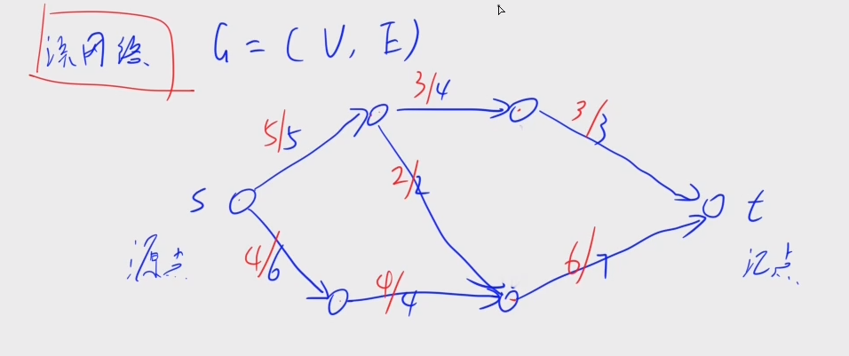
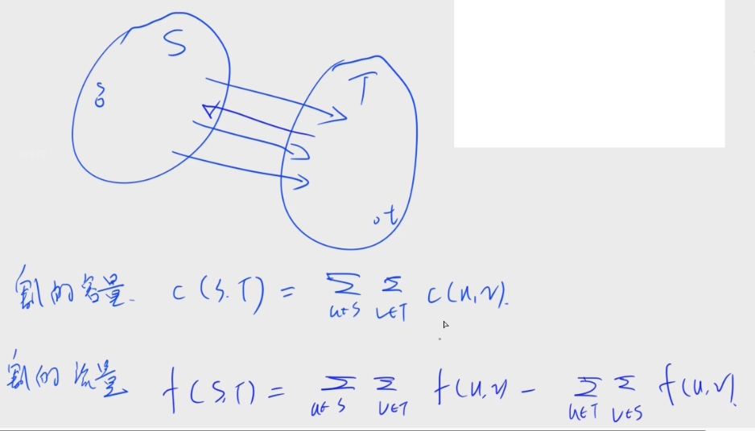
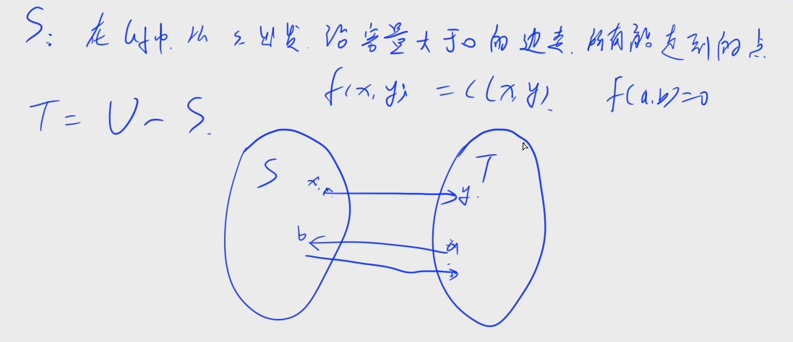
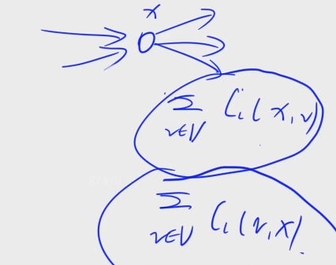
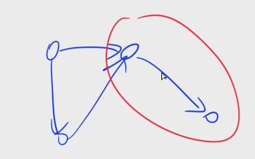
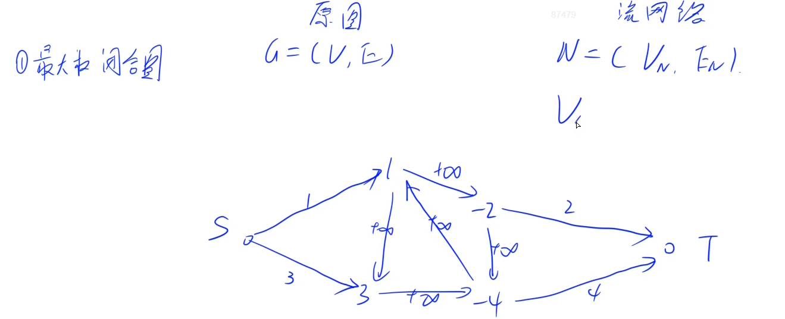

# 概念

流网络$G=(V,E)$：一个有向图，有源点和汇点，每条边上的权值为流量，表示这条边每次能通过的最大流量。就好比有水从源点源源不断地流向汇点，在这个过程中，水会流向多个管道，但是每条管道都会有流量限制。**不考虑反向边**。如果有反向边，也可以通过加点的方式变成没有反向边。

可行流 $f$ ：满足 1. 容量限制 $0\le f(u,v) \le c(u,v)$，2. 流量守恒（除了源点和汇点之外，其余所有点都不存储流）$v,x \in \{V / \{s,t\} \} \ \ \sum_{(v,x)\in E} f(v,x) = \sum_{(x,v)\in E} f(x,v)$  。这里**不考虑反向边**。$|f|$ 表示从源点到汇点的流量值是多少，或者说速率。$|f|=\sum_{(s,v)\in E}f(s,v) - \sum_{(v,s) \in E}f(v,s)$ ，简单地说就是源点往外流的流量减去往源点流的流量。



**最大流** ：所有可行流中流量值最大的可行流，也就是最大可行流

**残留网络**$G_f$：残留网络是针对流网络的某一条可行流来说的，残留网络里面的点是原网络的点集，残留网络的边集是原来网络里面的边集和反向边集，权值的定义为：
$$
c^\prime(u,v)
\left\{
\begin{aligned}
&c(u,v)-f(u,v) & (u,v)\in E \\
&f(u,v) & (v,u) \in E \\
\end{aligned}
\right.
$$
残留网络可能也有可行流 $f^\prime$ ，**原网络的可行流+残留网络的可行流也是原图的可行流**，因此 $|f+f^\prime|=|f|+|f^\prime|$
可行流相加等价于边相同方向则权值累加，边相反则原图边减去残留网络边的权值

$f+f^\prime$ 是否是原图可行流？判断是否满足容量限制和流量守恒即可

**残留网络里面没有可行流，原网络可行流一定是最大流**

**增广路径**： 在残留网络里面，沿着容量大于 $0$ 的边走，如果能走到终点，则这条路径被称为增广路径

**割**：将点集 $V$ 分成 $S$ 和 $T$ 两个子集，使得 $S\cup T = V$ 并且 $S \cap T = \emptyset$ ，$s \in S$，$t \in T$ 。换句话说，把点集分成不重的两个部分，源点在 $S$ 集中，汇点在 $T$ 集中，划分的这个结果称为图中的一个割。点集不一定连通。
任意图一共有 $2^{n-2}$ 个割



割的容量$c(S,T)$：指的是划分后的 $S$ 集中点到 $T$ 集中的边的权值之和

**最小割**：所有割中容量最小的割

割的流量$f(S,T)$：割的流量是对一个可行流来说的，就是 $S$ 到 $T$ 的边的所有可行流值减去 $T$ 到 $S$ 的边的所有可行流值

**割的性质**
1. 任意一个割$[S,T]$和任意一个流$f$，一定有 $f(S,T) \le c(S,T)$ 
2. 任意一个割$[S,T]$和任意一个流$f$，一定有 $f(S,T) = |f|$
	直观地思考一下，$s$ 流到 $t$ 的容量等价于 $S$ 流到 $T$ 的净流量

稍微证明：设 $f(X,Y) = \sum_{u\in X}\sum_{v \in Y} f(u,v) - \sum_{u\in X}\sum_{v \in Y} f(v,u)$
那么，有$f(X,Y) = -f(Y,X)$，$f(X,X)=0$，
如果，$X\cap Y = \emptyset$，$f(Z,X\cup Y)=f(Z,X)+f(Z,Y)$，同样地 $f(X\cup Y,Z)=f(X,Z)+f(Y,Z)$ 
因此，$f(S,V)=f(S,S)+f(S,T)$，也就是 $f(S,T)=f(S,V)$
从而有
$$
f(S,T)=f(\{s\},V)+f(S-\{s\}, V)
$$
由于 $S - \{s\}$ 集合不包含源点 $s$ 和汇点 $t$，根据流量守恒，$f(S-\{s\},V)=0$
因此 $f(S,T)=f(\{s\},V)=|f|$ 

推论3. 任意一个割$(S,T)$和任意一个流$f$，有 $|f| \le c(S,T)$

从而得知：最大流 $\le$ 最小割

**最大流最小割定理：**
（1）可行流 $f$ 是最大流
（2）可行流 $f$ 的残留网络中不存在增广路
（3）存在某个割 $[S,T]$ ，$|f|=c(S,T)$
三个条件两两等价

---
证明：
（1）$\Longrightarrow$ （2）。可以用反证法证明，如果存在增广路，那么这个残留网络的可行流 $|f^\prime| \gt 0$ ，因此 $f+f^\prime$ 是一个更大的可行流，这与 $f$ 是最大流矛盾

（3）$\Longrightarrow$ （1）。根据上面的推论3，最大流 $\le c(S,T)$ ，而又因为有 $|f| = c(S,T)$ ，因此最大流 $\le |f|$ ，又根据定义 $|f| \le$ 最大流。从而，存在有某个割 $[S,T]$，$|f|=c(S,T)$ ，那么 $f$ 是最大流。从这里还能发现一个隐含的等于，由于最大流 $\le$ 最小割，又有 最小割  $\le c(S,T) = |f| \le$ 最大流。因此，**最大流=最小割**

（2）$\Longrightarrow$（3）。用构造来证明，就是在残留网络中不存在增广路能否构造出一个割，使得 $|f|=c(S,T)$。我们构造 $S$ 为在 $G_f$ 中沿着容量大于 0 的边所有能走到的点，$T = V - S$，这样子 $s\in S$，$t\in T$ 是一个合法的割。注意：割虽然是根据残留网络构造，但是划分里面的边还是原网络里面的边。

对于 $x \in S, y \in T$，如果 $(x,y) \in E$ ，那么 $f(x,y)=c(x,y)$，因为从构造角度来看，在残留网络中 $(x,y)$ 的权值为 $c(x,y)-f(x,y)$，如果这个值是大于0，则 $y \notin T$ ，这与划分矛盾。
同样地，对于 $a\in T, b \in S$，如果 $(a,b) \in E$，那么 $f(a,b)=0$，因为从构造的角度来看，在残留网络中，如果 $f(a,b) \gt 0$  ，那么其建立的反向边 $f(b,a)=f(a,b) > 0$ ，则 $a \notin T$ ，这与划分矛盾。

从而 $|f|=f(S,T)=\sum_{u\in S}\sum_{v \in T} f(u,v) - \sum_{u\in S}\sum_{v \in T} f(v,u) =  \sum_{u\in S}\sum_{v \in T} f(u,v) = \sum_{u\in S}\sum_{v \in T} c(u,v)$  



---

# 算法
无论什么算法，都逃不过 FF 方法，也就是
1. 找增广路径
2. 更新残留网络
似乎有 ISAP 算法可替代，HLPP 算法优化很大，常用背 dinic 算法即可
  ## EK 算法

时间复杂度 $O(nm^2)$，处理 1000~10000 的网络没有问题
代码如下：
```c++
#include <iostream>
#include <cstring>

using namespace std;

const int N = 1010, M = 20010, INF = 0x3f3f3f3f;

int n, m, S, T;
int h[N], e[M], ne[M], f[M], idx = 0;
bool st[N];
int d[N], q[N], pre[N];

void add(int a, int b, int c) {
    e[idx] = b, f[idx] = c, ne[idx] = h[a], h[a] = idx ++ ;
}

int bfs() {
    memset(st, 0, sizeof st);
    int hh = 0, tt = 0;
    q[0] = S; st[S] = true; d[S] = INF;
    
    while (hh <= tt) {
        int u = q[hh ++ ];
        for (int i = h[u]; ~i; i = ne[i]) {
            int v = e[i];
            if (!st[v] && f[i]) {
                st[v] = true;
                d[v] = min(d[u], f[i]);
                pre[v] = i;
                if (v == T) return true;
                q[++ tt] = v;
            }
        }
    }
    return false;
}

int EK() {
    
    int ans = 0;
    while (bfs()) {
        ans += d[T];
        for (int i = T; i != S; i = e[pre[i] ^ 1])
            f[pre[i]] -= d[T], f[pre[i] ^ 1] += d[T];
    }
    return ans;
}

int main() {
    
    memset(h, -1, sizeof h);
    
    cin >> n >> m >> S >> T;
    while (m -- ) {
        int a, b, c; cin >> a >> b >> c;
        add(a, b, c), add(b, a, 0);
    }
    
    cout << EK() << endl;
    return 0;
}
```
## dinic 算法

时间复杂度 $O(n^2m)$ ，处理 10000 ~ 100000 的网络没有问题

思路：
1. `bfs` 建立分层图
2. `dfs` 找出所有能增广的路径
代码如下：
```c++
#include <iostream>
#include <cstring>

using namespace std;

const int N = 10010, M = 200010, INF = 0x3f3f3f3f;

int n, m, S, T;
int h[N], e[M], ne[M], f[M], idx = 0;
int q[N], d[N], cur[N];

void add(int a, int b, int c) {
    e[idx] = b, f[idx] = c, ne[idx] = h[a], h[a] = idx ++ ;
}

bool bfs() {
    int hh = 0, tt = 0;
    memset(d, 0, sizeof d);
    d[S] = 1, q[0] = S, cur[S] = h[S];
    
    while (hh <= tt) {
        int u = q[hh ++ ];
        for (int i = h[u]; ~i; i = ne[i]) {
            int v = e[i];
            if (!d[v] && f[i]) {
                d[v] = d[u] + 1;
                cur[v] = h[v];
                if (v == T) return true;
                q[++ tt] = v;
            }
        }
    }
    return false;
}

int find(int u, int limit) {
    
    if (u == T) return limit;
    
    int flow = 0;
    for (int i = cur[u]; ~i && flow < limit; i = ne[i]) {
        cur[u] = i;
        int v = e[i];
        if (d[v] == d[u] + 1 && f[i]) {
            int t = find(v, min(f[i], limit - flow));
            if (!t) d[v] = 0;
            flow += t, f[i] -= t, f[i ^ 1] += t;
        }
    }
    return flow;
}

int dinic() {
    int r = 0, flow;
    while (bfs()) while (flow = find(S, INF)) r += flow;
    
    return r;
}

int main() {
    
    memset(h, -1, sizeof h);
    
    cin >> n >> m >> S >> T;
    
    while (m -- ) {
        int a, b, c; cin >> a >> b >> c;
        add(a, b, c); add(b, a, 0);
    }
    
    cout << dinic() << endl;
    return 0;
}
```

# 最大流模型

## 二分图模型

### 二分图最大匹配

二分图的最大匹配可以转化成一个网络流问题，时间复杂度为 $O(m\sqrt n)$ 

建图思路为：首先考虑一个源点 $S$ 和汇点 $T$，然后对于 $V_1$ 集中的点，每个点最多只会选择一次进行匹配，因此可以把 $S$ 和 $V_1$ 集中的每个点连接一条容量为 $1$ 的边，表示这条边对应的点要么不选，要么只选一次；然后对于 $V_2$ 集中的点，同样也最多只会选择一次进行匹配，因此可以将每个点向汇点连接一条容量为 $1$ 的边；最后原来 $V_1$ 和 $V_2$ 中的边都设置容量为 $1$ 。最后对这个转化后的图求得的最大流就是二分图最大匹配

证明：
首先证明二分图的一个匹配可以转化为新图中的一个可行流。显然满足流量守恒和容量限制。
其次证明新图中的一个整数可行流也可以转化成二分图的一个匹配。对于一个可行流，由于容量限制， $V_1$ 的出度一定要么是0，要么是 1，$V_2$ 的入度要么是 0 要么是 1，并且 $V_1$ 出度为 1 的点一定流向 $V_2$ 入度为 1 的点，这些流量为 1 的边就是一个匹配

### 二分图多重匹配

二分图的多重匹配指的是每个点可以多次匹配，但是有上限，或者说限制了每个点最多和多少条匹配边相关联


这个建图思路和上面类似，首先建立源点和汇点，然后源点连接一个点集，容量为点集 $V_1$ 能够匹配上限，点集 $V_2$ 连接汇点，容量为能够匹配上限。中间 $V_1$ 到 $V_2$ 的边按照原图连接，不过**容量为题目所限制的**

## 上下界可行流

### 无源汇
无源汇上下界可行流可以做一个转化变成一个正常最大流的一个限制
$(G,f) \Longrightarrow (G^\prime, f^\prime)$ 

简单来说，对于上下界可行流中的边可行流限制 $c_L(u,v) \le f(u,v) \le c_U(u,v)$ ，不等式两边减去其下界可得$0 \le f(u,v) \le c_U(u,v) - c_L(u,v)$ ，这样就变成了正常的最大流的容量限制。显现这个是满足容量限制的，但是不满足流量守恒。



假设存在这样的上下界可行流，那么对原网络进行转化后，每条边的流量要减去这条边的容量下界，因此此时不一定满足流量守恒。
单从某个点来说，原网络的流量守恒有 $\sum_{v\in V} C(x,v) = \sum_{v\in V}C(v,x)$ ，但是由于这里的容量变小了，令 $C_I = \sum_{c\in V} C^\prime(v,x),C_O = \sum_{c\in V} C^\prime(x,v)$ ，也就是说
$\sum_{v\in V} C(x,v) - C_O \neq \sum_{v\in V}C(v,x) - C_I$ 时，流量不守恒，我们需要执行操作使其守恒，也就是说，**如果 $C_I \gt C_O$，需要从源点 $S$ 连接一条到点 $x$ 的一条容量为 $C_I-C_O$ 的边，否则从 $x$ 连接到一条到汇点 $T$ 的一条容量为 $C_O - C_I$ 的边，最后判断其最大流在其新建边上是否满流即为存在上下界可行流**。

此建图方案是否可行等价于证明原网络的可行流可以变成新网络的最大流，新网络的最大流且满流是否可以还原成原网络的可行流。

### 有源汇
有源汇与无源汇的最大的区别在于有源汇中的源点和汇点流量是不守恒的，因此，此处的处理方法为**汇点连接源点一条容量为无穷大的边**，这样一定是满足流量限制且是无源汇的。

通过这样的转化后，要想判断是否有源汇上下界可行流，就判断新图是否满流，那么如何求这样的最大可行流呢？

有一个想当然的思路是：当进行对新图进行一遍dinic 算法之后，然后判断满流是否有可行流。再在这个新图上，把新加的原图中汇点到源点容量为正无穷的边删掉，再做一遍从原图中源点到汇点的dinic算法。如果求最小可行流就是最后做一遍汇点到源点的dinic算法，并减去即可。

这个方法从策略上是正确的，但是要注意从逻辑上区分，只是我们在这里恰好能做。

证明：$(G,f)\iff (G^\prime,f^\prime)$

对于原图任意的可行流，可以变成新图的一个满流。$(G,f_0)\Longrightarrow (G^\prime, f_0^\prime)$  

**做题细节**
注意：有源汇上下界分为最小流和最大流，另外最终的可行流流量可能为负数，假如 $S->T$ 的流量为 0，$T->S$ 的流量为 10，$S->T$ 的最小流就是 $-10$ 
对于最大流和最小流，都是要建立一条汇点到源点容量为无穷大的边，然后跑完第一次dinic算法之后，判断其是否满流。注意，这个时候如果我们还原成原图的可行流，其中的可行流流量是多少？就是新加的汇点到源点中**残余网路反向边的容量**，这个时候把这个汇点到源点的边删除。**从原来的源点跑汇点就是最大流，从源点的汇点跑到源点就是最小流**。

## 多源汇最大流

思路和最短路是思路是一样的，建立超级源点和超级汇点，其容量为无穷大即可。

## 关键边
最大流的关键边是如果我们把这条边的容量上界提升，那么最大流增加。
求解最大流关键边的步骤：
1. 先应用 dinic 算法求解最大流，那么残余网络正向边的容量为 0 的边可能是关键边
2. 分别对源点和汇点应用 dfs。对于源点来说，找到这个点只走残余网络正向边容量大于 0 的边能到的点；对于汇点来说，通过反向边遍历，限制是其对应的正向边的容量大于 0，找到所有能遍历到的点
3. 枚举所有满流的边，如果源点能走到它且汇点也能走到它，那么这就是关键边
## 利用网络流进行判断
* 最小化最大值类型
* 判断是否可行
## 拆点技巧
如果某些题对点具有限制，那么便可以进行拆点
# 最小割模型

割：$[S,T]$
割的流量 ：$f(S,T)$
割的容量：$c(S,T)$  

## 最大权闭合图

闭合图是对于有向图来说的， 也就是$G(V,E)$ 中的一个点集，这个点集相关的所有边，不能从点集里面指向点集外面，如下图红色圈内所示



点集加上点集内部的边被称为原图的一个闭合子图，那么最大权闭合子图就是**点的权值之和**最大的闭合子图

做法就是转化成最小割模型，首先将其转化成流网络，如下图所示



可以证明原图的一个闭合子图对应流网络的一个割
对于这个问题本身有个**简单割**的概念：指的是所有的割边一定是和源点或者汇点相连 ，现在简单割是所有割的子集

**最小割一定是简单割**。因为最大流最小割定理，最小割一定是有限值，而且中间的边都是无穷，因此最小割一定是简单割

现需要证明 **闭合子图对应一个简单割**
假设有闭合子图 $V^\prime$，其对应的割 $[S,T]$，其中 $S = V^\prime +\{s\}, T = V - S$ ，因为 $V^\prime$ 是所有出边都是在 $V^\prime$ 里面，因此，割边不存在容量为无穷的边，因此这个闭合子图对应一个简单割

**数量关系**：$c[S,T]=c[V^\prime,\{t\}]+c[\{s\},\overline{V^\prime}]=\sum_{v\in {V^\prime} ^-}{(-w_v)} + \sum_{v\in {\overline{V}^\prime}^+}w_v$ 
又闭合子图的权值之和为 $W(V^\prime)=\sum_{v\in {V^\prime} ^+}{(w_v)} - \sum_{v\in {V^\prime}^-}(-w_v)$
因此，$c[S,T]+W(V^\prime)=$ 所有的正权值之和
由于等式右边是定值，所有要想 $W(V^\prime)$ 最大，$c[S,T]$ 得最小，等价于求最小割

**方案**
最大闭合子图就是 $S$ 通过残余网络能到的所有点

## 最大密度子图

在无向图里面选择一些点和一些边，这个点集都是在边里面的，其密度为 $\frac{|E^\prime|}{|V^\prime|}$ ，求密度最大的子图

这个一般是 [[最短路模型#0/1 分数规划]] 问题，因此二分一个 $mid$  ，因此如果存在 $\frac{|E^\prime|}{|V^\prime|} > mid$ ，也就是 $mid * |V^\prime|  - |E^\prime| < 0$   因此相当于是求 $mid * |V^\prime| - |E^\prime|$  的最小值，如果其小于 0 ，等价于存在 $\frac{|E^\prime|}{|V^\prime|} > mid$ 

**拓展** 事实上这个问题可以转化成最大权闭合图，根据**选择的边其相应的点一定要选择**，可以将边也看作点，不过要求的是 是否存在 $|E^\prime| - mid * |V^\prime|$ 的最大值大于 0，这样才等价于最大权


有这样一个性质：**如果选择了一些点，其内部边一定全部选择才能使其密度最大**，因此可以得到其计算公式：
$$
mid * |V^\prime| - |E^\prime| = \sum_{v \in V^\prime} mid - \frac{\sum_{v\in V^\prime}d_v - c[v^\prime,\overline{v}^\prime]}{2}
$$
边的计算方法就是其点的度数之和减去割的容量除2，因为是在无向图中。这样就和割关联起来

等式变形：
$$
mid * |V^\prime| - |E^\prime| = \frac{1}{2}(\sum_{v\in V^\prime} (2*mid - d_v) + c[v^\prime,\overline{v}^\prime])
$$
但是问题在于左边这项怎么处理，其是通过每个点都向汇点连接一条容量是 $2*mid-d_v$ 的边，原图内部边容量为 1，然后源点向每个点连接一条容量为 1 的边。

但是这里出现了另外一个问题，就是 $2*mid-d_v$ 可能小于0，因此这里有个策略是源点连接所有点的边的容量和所有点连接汇点的边的容量都加上一个偏移量 $U$ ，**但是，注意，不是所有图都能这样子加，这是因为这个问题的特殊性**。

可以计算，最后 $c[S,T]=U*n + 2* mid |V^\prime|-2|E^\prime|$ 
因此，求出变化后的流网络的最小割之后，其原网络的最小割为 $\frac{c[S,T] - U*n}{2}$  

**如果有边权怎么办？**
就是每条边有大于 0 的权值，区别在于 $|E^\prime|$ 的计算，其中 $d_v$ 不再是每个点的度，而是与其相关所有边的权值之和

**如果同时有点权和边权怎么办**？
一般来说，如果同时存在会最大化 $\frac{|E^\prime|+|V^\prime|}{|V^\prime|}$ ，等价于最小化 
$$
mid*|V^\prime|-|V^\prime|-|E^\prime|=\frac{1}{2}(\sum_{v\in V^\prime} (2*mid - 2*p_i- d_v) + c[v^\prime,\overline{v}^\prime])
$$
和上面比较不过是稍微修改了下流网络的权值

**方案**
最大密度子图的方案为：$S$ 通过残余网络能到的所有点
## 最小权点覆盖集

假设所有点权值非负，求总权值之和最小的点覆盖集
这在一般图中是 NP-hard ，但是在二分图中不是

建图：二分图原图连接的边的容量为无穷大，源点到左部集的边的容量为对应点的权值，右部集到汇点的边的容量为对应点的权值

可以证明：一个简单割对应一个点覆盖集

同样：也可以看出一个割的容量对应了一个点覆盖集的权值之和，因此，**求二分图的最小权点覆盖就等价于求新图的最小割**

求方案：首先根据最大流求出 $S$ 和 $T$ 集合，然后求割边，已经割边是最小割，要么源点是 $S$ ，要么汇点是 $T$ ，因此
## 最大权独立集合

注意：权值如果有非负 那么提前把非负的点提前选上
在二分图中，最大权独立集 = 所有点的总权值 - 最小权点覆盖 

1. 假设点集 $V$ ，点覆盖集为 $V_1$ ，补集 $V_2=V-V_1$ 是独立集
**证明**
反证法：假设 $V_2$ 中 $v_1,v_2$ 有边，说明这条边里面没有被覆盖，因此与假设矛盾
2. 假设有独立集 $V_2$ ，$V_1 = V - V_2$ 一定是点覆盖集
**证明**
反证法：假设 $V_1$ 不是点覆盖集，那么一定存在一条边 $(v_1,v_2)$ 没有被覆盖，或者说任意两点不在 $V_1$ 中，因此其都在 $V_2$ 中，与 $V_2$ 是独立集矛盾


## 做题思路
1. 构造流网络
2. 证明简单割和原图可行方案一一对应
3. 思考数量关系

# 费用流模型

费用流--所有最大可行流中费用最小/最大值：$\sum f(u,v)w(u,v)$ 

Q：图 $G$ 有最大流，是否一定有最小费用最大流？A：一定有

 把 EK 算法中的 bfs 换成 spfa 即可求出费用流
 一般情况下，要保证没有负权回路  
 假设正向边的费用是 $w(u,v)$，那么反向边的费用为 $-w(v,u)$ 只要原图没有负权回路，那么残留网络求最短路就没有负权回路

如果有负环回路，需要消圈法去解决

## 二分图最优匹配

> 敬请期待

## 无源汇有上下界最小费用可行流

> 敬请期待